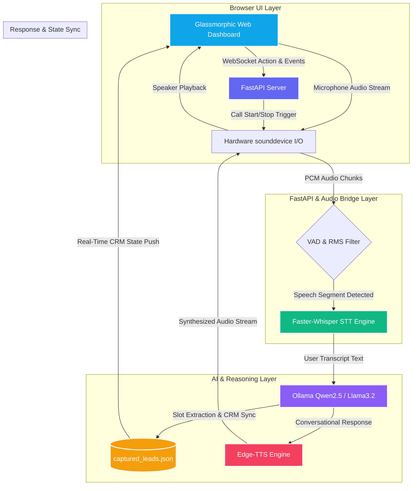

# ARCHITECTURE.md: AI Voice Agent

## 1. High-Level System Architecture Diagram
Below is the visual workflow of the real-time duplex voice pipeline, illustrating how audio streams between the browser UI, FastAPI backend, local AI models, and CRM storage.

## 2. Component Breakdown

* **FastAPI Server (app.py):**  Acts as the central communication bridge. It handles WebSocket connections (/ws) for instant bidirectional event pushing (status updates, chat logs, and CRM data sync) between the backend worker threads and the frontend UI.
* **Hardware I/O & VAD (sounddevice):** Captures raw audio streams at 16kHz from the local microphone. Implements a Root Mean Square (RMS) Voice Activity Detector (VAD) to dynamically filter background noise and trigger immediate interruption (Barge-in) if the user speaks while the agent is talking.
* **Speech-to-Text (Faster-Whisper):** Powered by the CPU-optimized base.en model using int8 quantization. It instantly transcribes speech segments into text with tailored domain prompts (e.g., "2 BHK, 3 BHK, lakh, crore, site visit").
* **Language Model Intelligence (Ollama / Qwen2.5):** Acts as "Aria", the real-estate sales advisor. Constrained by strict system prompts containing property facts and a concise response rule (max 20 words) to ensure low-latency, conversational replies.
* **Text-to-Speech (Edge-TTS):** Streams low-latency neural speech (en-US-JennyNeural) directly into memory for immediate hardware audio playback.

## 3. State Management & Conversational Memory Strategy

During a live voice consultation, maintaining accurate context and prospect data without latency is critical. The system handles this through a dual-layer strategy:
### A. In-Call Memory & Slot Extraction (RealEstateAgent Class)
* **Regex Slot Extraction:** As every user input arrives, background regex pattern matchers parse entities such as names, phone numbers, unit preferences (2/3 BHK), budget limits, and site visit confirmations.
* **Progressive Goal Tracking:** The agent maintains a lead_memory dictionary that tracks what information has been captured and dynamically sets the next conversation goal (e.g., if the phone number is missing, the LLM prompt is updated to prioritize asking for the phone number).

 ### B. Persistence & CRM Synchronization (captured_leads.json)
 * **Real-Time UI Push:** Every time a slot is extracted or updated, sync_crm_to_ui() immediately broadcasts the updated CRM metrics over WebSockets, updating the visual dashboard elements (Priority Score, Client Name, Phone, Budget, Site Visit status) with clear status-based indicators (Pending vs. Filled).
 * **Automatic JSON Persistence:** Leads are safely saved and updated incrementally inside captured_leads.json indexed by call timestamp and lead scoring algorithms (HOT, WARM, COLD), ensuring zero data loss even upon sudden call termination.

